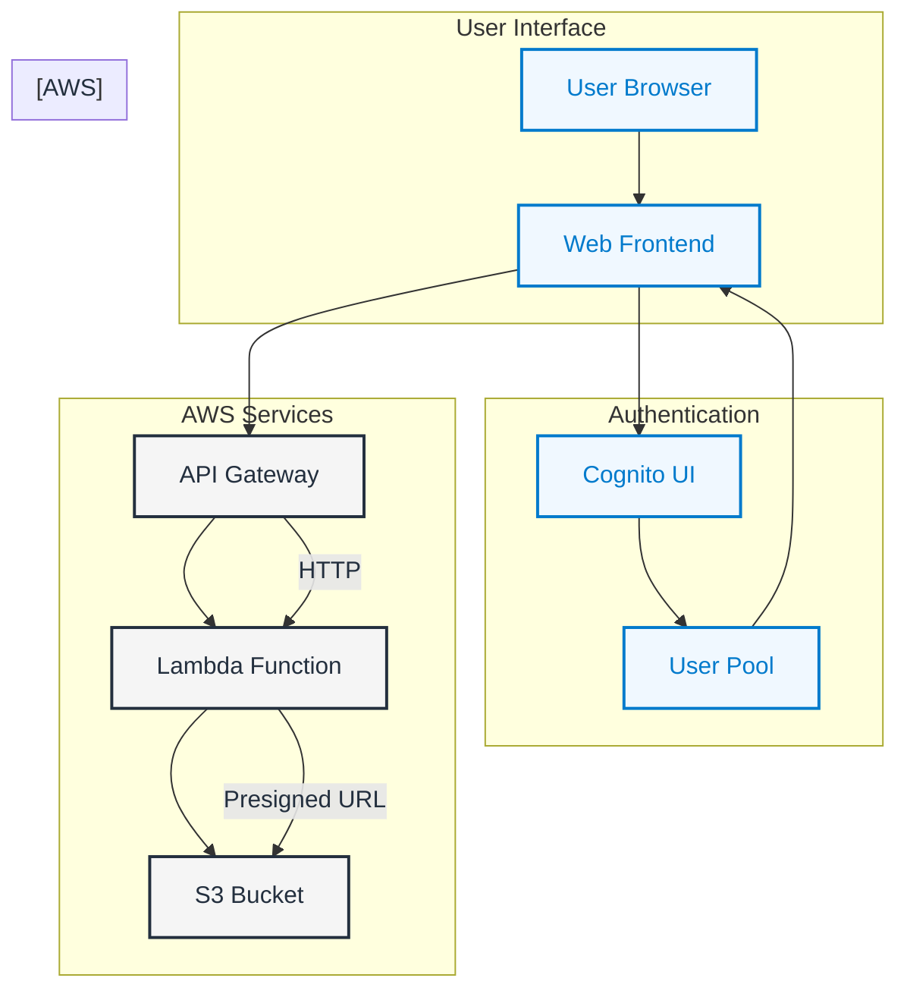

# Serverless File Uploader (AWS + Terraform)

This secure file upload solution allows users to securely upload files to Amazon S3 using a modern web interface. The application leverages AWS serverless technologies to provide a scalable and cost-effective solution while maintaining enterprise-grade security through AWS Cognito authentication.

## 🚀 Features

- Secure file uploads to Amazon S3
- User authentication via AWS Cognito
- Modern web interface built with HTML/JavaScript
- Serverless architecture using AWS Lambda and API Gateway
- Infrastructure as Code with Terraform
- Presigned URLs for secure file uploads
- Regional deployment in AWS eu-west-1

## 🛠️ Tech Stack

This project is built using:
- **Amazon S3** for file storage
- **AWS Lambda** for backend logic
- **API Gateway (HTTP)** to expose the Lambda
- **Cognito** for secure user authentication
- **Terraform** for infrastructure deployment

---

## 📱 Architecture



## 🌍 Region

All AWS resources are deployed in `YOUR SELECTED REGION`.

---

## 🧰 Prerequisites

- [AWS CLI](https://docs.aws.amazon.com/cli/latest/userguide/install-cliv2.html)
- [Terraform](https://www.terraform.io/downloads)
- An AWS Account with sufficient permissions

---

## 🚀 Deployment

1. **Clone the repository**
   ```bash
   git clone https://github.com/chf-4u/serverless-file-uploader.git
   unzip serverless-file-uploader.zip
   cd serverless-file-uploader
   ```

2. **Initialize Terraform**
   ```bash
   terraform init
   ```

3. **Review and apply infrastructure**
   ```bash
   terraform apply
   ```

4. **Note the outputs**
   Terraform will output:
   - S3 Bucket name
   - API Gateway endpoint
   - Cognito Hosted Login URL
   - Cognito Domain
   - Cognito User Pool ID
   - Cognito Client ID
  
5. **Update Placeholders in files**
   Use the above outputs to update:
   - Index.html file
   - Variables.tf file 

---

## 📁 Project Structure

```
.
├── README.md          # Project documentation
├── index.html         # Frontend interface
├── lambda/            # Lambda function code
│   └── generate_presigned_url.py
├── lambda.zip         # Lambda deployment package
├── main.tf            # Main Terraform configuration
├── outputs.tf         # Terraform output definitions
└── variables.tf       # Terraform input variables
```

---

## 📝 Git Ignore Recommendations

Add these patterns to your `.gitignore`:
```
# Terraform state files
.terraform/
*.tfstate
*.tfstate.*

# Lambda deployment package
lambda.zip

# Test files
test.txt
```

---

## 📝 Lambda Environment

To test locally or update Lambda code:
- Located in `lambda/generate_presigned_url.py`
- Environment Variable (optional): `UPLOAD_BUCKET` defaults to the S3 bucket created.

Rebuild the Lambda ZIP before applying changes:
```bash
cd lambda
zip ../lambda.zip generate_presigned_url.py
cd ..
terraform apply
```

---

## 🧪 Testing the Upload

### 1. Run the HTML frontend locally

```bash
python -m http.server 3000
```

Visit: [http://localhost:3000](http://localhost:3000)

### 2. Login with Cognito

Click the **"Login with Cognito"** button — it redirects to AWS-hosted login.

### 3. Upload a file

Choose a file, click **Upload**, and it will be uploaded via a presigned URL to S3.

### 4. Verify upload

Go to your S3 bucket in the AWS Console. Uploaded files are stored in the `uploads/` folder.

---

## 🔐 Authentication

- Users are authenticated with Cognito using the Hosted UI.
- The frontend extracts the `id_token` from the redirect URL and uses it to authenticate API requests.

---

## ⚙️ Configuration

The project uses Terraform variables defined in `variables.tf`. You can modify these values to customize your deployment:

```hcl
variable "region"              // AWS Region
variable "bucket_name"         // Name of the S3 bucket
variable "cognito_domain_prefix" // Unique domain prefix for Cognito
```

---

## 📁 Project Structure

```
serverless-file-uploader/
├── index.html               # Frontend uploader
├── main.tf                  # AWS Infrastructure
├── variables.tf             # Inputs for Terraform
├── outputs.tf               # Outputs from Terraform
├── lambda/
│   └── generate_presigned_url.py
```

---

## 🧹 Cleanup

```bash
terraform destroy
```

This will delete all AWS resources created by this project.

---
